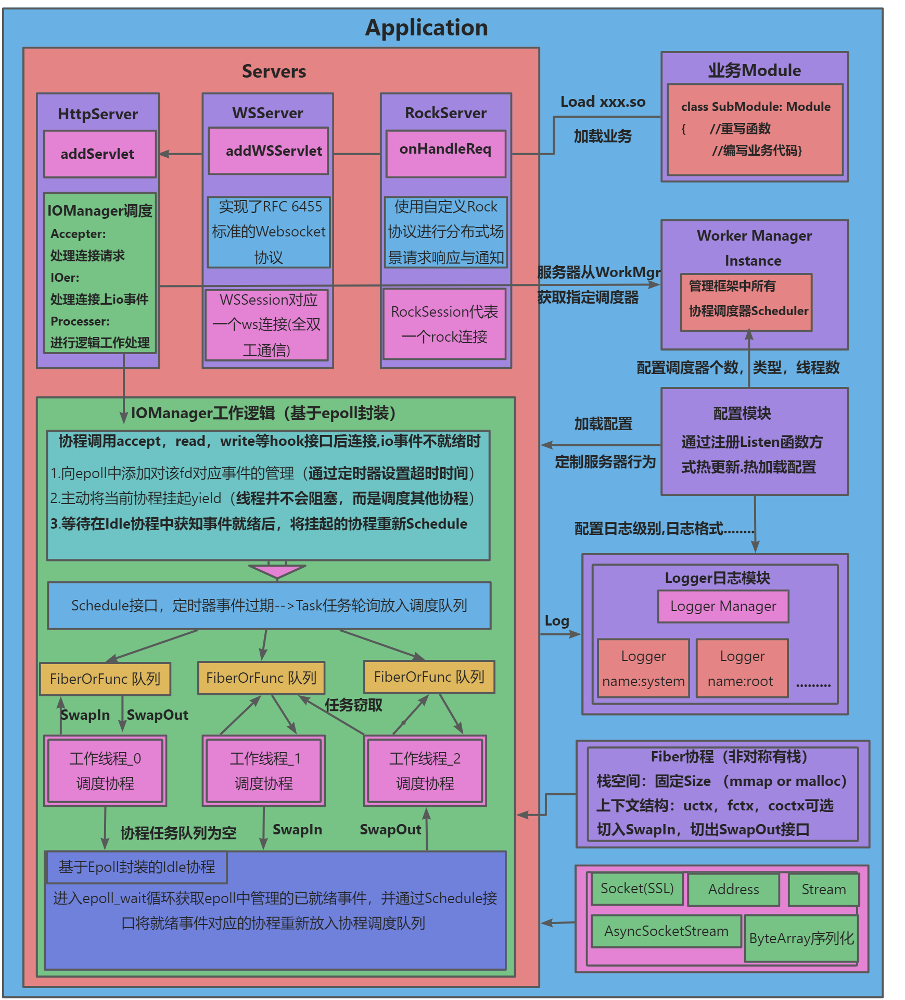

# Xten
[](https://en.cppreference.com/)

## 项目简介
Xten是一个基于协程网络库实现的C++高性能服务器框架，旨在使用协程简化异步网络编程，解决异步编程时面临的回调地狱问题，同时在Server层使用同步的编程方式实现异步回调编程的性能。

核心协程网络库的实现类似go语言的GMP+net包的实现，为每一个线程M都分配了一个协程运行队列P，协程G放入运行队列中被线程调度获取cpu执行时间，并实现了基于epoll封装的协程调度策略用于在网络io场景下高效调度协程。目前的服务器框架封装了http协议，websocket协议，自定义分布式Rock协议，并在Server层实现了httpServer，websocketServer，分布式rpc服务器RockServer。

Xten将动态库封装成Module模块，支持以运行时显式链接动态库的方式加载具体的业务代码到Xten服务器框架中。在使用Xten服务器框架进行业务开发时，只需要继承服务器提供的Module模块实现具体的业务模块并编译成动态库，启动Xten服务器框架后自动链接该动态库即可完成业务模块的注册。
## 编译运行
* 项目依赖yaml-cpp库，Openssl库及ragle解析器，确保环境中已经安装了相应库并能被链接器找到。
```sh
git clone https://github.com/California-817/Xten.git
cd Xten
mkdir build
cd build
cmake [-DFIBER_TYPE=xxx] ..    (xxx=FIBER_UCONTEXT,FIBER_FCONTEXT,FIBER_COCTX)-->协程上下文类型选择
make  //确保系统已经安装了yaml-cpp，openssl库

//编译成功后，生成两个文件：Xten/lib/libXten.a   Xten/bin/main 
//启动服务器框架
cd Xten/bin
./main -d -c ./conf
```
* 业务模块Module的加载示例
```sh
cd Xten/template
mkdir build
cd build
cmake ..
//此时会生成libMymodule.so动态库到Xten/bin/module目录下,
//启动服务器后会查找该目录下的所有.so并通过dlopen打开并创建模块，自动加载业务代码。
```
## 特性
1. 支持多级日志输出，对多线程与协程上下文信息记录，可自定义日志配置与格式。
2. 支持使用yaml配置文件进行配置服务器框架的所有参数，并通过注册回调函数的机制实现热加载，热更新配置。
3. 基于pthread库封装了Thread类，封装了线程锁，信号量，并实现了协程信号量，协程锁。
4. 实现非对称有栈协程Fiber，可通过cmake编译选项选择glibc库的ucontext，boost库的fcontext，libco库的coctx三种协程上下文结构实现协程的上下文的保存与切换。协程栈内存不可伸缩，默认为128KB，可通过配置文件修改栈内存。
5. 实现非抢占式协程调度器，调度器 : 线程 : 协程=1:N:M，每个工作线程对应一个协程运行队列，并且实现了任务窃取与定期负载均衡功能。工作线程在调度协程，任务协程，空闲协程中不断切换。
6. 继承协程调度器实现基于epoll封装的IO协程调度器，用于在网络io场景下的高效协程调度。
7. 实现两种定时器方案，基于红黑树+epoll_wait超时参数配合IO协程调度器使用 ；基于多层级时间轮+usleep用于处理业务场景下的海量高精度定时任务。
8. 对网络I/O和文件I/O，socket相关的系统调用接口进行hook重定向，从而达到IO或连接条件不就绪自动挂起协程，条件就绪后唤醒协程的目的。
9. 基于面向对象的思想封装了地址类Address与套接字类Socket，并提供了静态工厂方法快速创建指定功能及类型的Address与Socket对象
10. 实现二进制序列化数组结构ByteArray，支持定长编码与varint变长编码以减少数据体积。
11. 通过Stream流的方式封装读写操作，统一文件读写，缓冲区读写与网络读写接口。实现同步socket流SocketStream，压缩流ZlibStream。
12. 封装http协议，使用Ragle解析http报文以获取极致性能，实现httpServer支持请求解析，响应生成，并且通过Servlet分发功能实现指定uri的业务注册。
13. 实现了RFC 6455标准的websocket协议，并实现了websocket服务器模块，支持HTTP协议升级握手，升级协议后的全双工实时通信。
14. 基于同步socket流实现异步流AsyncSocketStream，支持异步并发请求，请求与响应的自动匹配，超时自动重连。
15. 实现自定义分布式Rock协议进行高性能的二进制序列化通信，基于此协议实现了rpc服务器RockServer，支持请求-响应和通知两种通信模式，并集成gzip压缩和protobuf序列化方案。
16. 实现基于动态库加载的模块化管理框架，支持运行时动态加载.so模块并统一管理，提供模块生命周期控制、类型分类管理和批量操作等功能。
17. 封装服务器应用框架核心模块Application，提供命令行参数解析、配置管理、守护进程运行、模块加载和多协议服务器统一管理等功能。
## 核心架构图

## 协程网络库工作大致流程
```cpp
int main()
{
    Xten::IOManager iom1=std::make_shared<Xten::IOManager>(1,true,"Accept Worker"); //启动一个接受连接协程调度器
    Xten::IOManager iom2=std::make_shared<Xten::IOManager>(2,false,"IO Worker"); //启动一个处理连接上网络IO的协程调度器
    iom1->Schedule([iom2](){
        //创建Listen套接字
        auto addr=Xten::IPv4Address::Create("0.0.0.0:8080");
        auto sock=Xten::Socket::CreateTCPSocket(addr);
        sock->Listen();
        while(true)
        {
            //循环接受网络连接
            auto client=sock->accept();
            //将新连接的IO处理放入iom2协程调度器中处理
            iom2->Schedule([client](){
                //client->read 
                // ......
                //client->write 
            });
        }
    });
}
```

## 性能测试
* 机器: 4核心8g内存
* 压测工具：ab（ApacheBench）
* 对比程序： Nginx，workflow
* 压测方法：在同一台虚拟机上启动ab与Nginx，Xten，workflow进行压测，对于压测http请求仅简单返回一个响应，不做复杂处理。
### 1.短连接（100w请求，2000并发）
```sh
ab -n 1000000 -c 2000 http://127.0.0.1:port/
```
| Nginx | QPS | Time Per Request |                           
|----|----|----|
| 1 | 25163.12 [#/sec] (mean) | 79.481 [ms] (mean) |
| 2 | 25127.29 [#/sec] (mean) | 79.595 [ms] (mean) |
| 3 |  24723.34 [#/sec] (mean) | 80.895 [ms] (mean) |
| 4 | 24793.54 [#/sec] (mean) | 80.666 [ms] (mean)|
| 平均 | 24951.82 [#/sec] (mean) | 80.159 [ms] (mean) |

| workflow | QPS | Time Per Request |
|----|----|----|
| 1 | 28080.34 [#/sec] (mean) | 71.224 [ms] (mean) |
| 2 | 27688.82 [#/sec] (mean) | 72.231  [ms] (mean) |
| 3 | 27665.73 [#/sec] (mean) | 72.292 [ms] (mean) |
| 4 | 28627.65 [#/sec] (mean) | 69.863 [ms] (mean) |
| 平均 | 28015.64 [#/sec] (mean) |  71.403 [ms] (mean) |

| Xten | QPS | Time Per Request |
|----|----|----|
| 1 | 30546.46 [#/sec] (mean) | 65.474 [ms] (mean) |
| 2 | 29377.67 [#/sec] (mean) | 68.079 [ms] (mean) |
| 3 | 31343.15 [#/sec] (mean) | 63.810 [ms] (mean) |
| 4 | 29680.18 [#/sec] (mean) | 67.385 [ms] (mean) |
| 平均 | 30236.87 [#/sec] (mean) | 66.187 [ms] (mean) |
### 2.长连接(keepalive) （100w请求，2000并发）
```sh
ab -n 1000000 -c 2000 -k http://127.0.0.1:port/
```
| Nginx | QPS | Time Per Request |
|----|----|----|
| 1 | 171368.27 [#/sec] (mean) | 11.671 [ms] (mean) |
| 2 | 172247.96 [#/sec] (mean) | 11.611 [ms] (mean) |
| 3 | 170713.63 [#/sec] (mean) | 11.716 [ms] (mean) |
| 4 | 168715.06 [#/sec] (mean) | 11.854 [ms] (mean) |
| 平均 | 170761.23 [#/sec] (mean) | 11.713 [ms] (mean) |

| workflow | QPS | Time Per Request |
|----|----|----|
| 1 | 86515.86 [#/sec] (mean) |  23.117 [ms] (mean) |
| 2 | 86242.98 [#/sec] (mean) |  23.190 [ms] (mean) |
| 3 | 85471.95 [#/sec] (mean) |  23.399 [ms] (mean) |
| 4 | 87691.82 [#/sec] (mean) | 22.807 [ms] (mean) |
| 平均 | 86480.65 [#/sec] (mean) | 23.128 [ms] (mean) |

| Xten | QPS | Time Per Request |
|----|----|----|
| 1 | 120914.86 [#/sec] (mean) | 16.541 [ms] (mean) |
| 2 | 123223.15 [#/sec] (mean) | 16.231 [ms] (mean) |
| 3 | 119848.46 [#/sec] (mean) | 16.688 [ms] (mean) |
| 4 | 120064.71 [#/sec] (mean) | 16.658 [ms] (mean)|
| 平均 | 121012.80 [#/sec] (mean) | 16.530 [ms] (mean) |

### 总结
| **连接方式** | **服务**   | **QPS 平均值** | **平均延迟 (ms)** |
| -------- | -------- | ----------- | ------------- |
| 短连接    | nginx    | 24951.82    | 80.159        |
|          | workflow | 28015.64    | 71.403        |
|          | Xten     | 30236.87    | 66.187        |
| 长连接   | nginx    | 170761.23   | 11.713        |
|    | workflow | 86480.65    | 23.128        |
|          | Xten     | 121012.80   | 16.530        |
* 在短连接情况下 Xten性能要高于Nginx和workflow
* 在长连接情况下 Xten性能高于workflow 低于Nginx
## 交流方式
QQ：1876439531

QQ邮箱：1876439531@qq.com

Auther：California-817

